Miquel Marquès Bravo

**AA2 Quotes FSRM**
## ABANS
`	`Comanda **fsutil createnew [fitxer] [espai en bytes]**

`	`Comanda (Get-Item "C:\Users\[usuari]\[carpeta\document").CreationTime=("[21 de febrero de 2013 12:00:00]") / .LastAccesTime=("[21 de febrero de 2013 12:00:00]")

## Exercici 1
- **Primer veurem les quotes NTFS. Per fer-ho, ves a propietats del segon disc del server i ves a Quota.**

- **Posa un límit de 200 MB als usuaris.**

  En aquest punt que estem en el NTFS de quotes del servidor en què posem que el límit de l'espai de 200 MB i un avís de 150 MB

  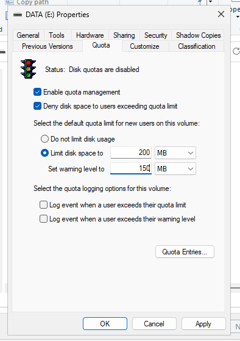

- **Documenta les diverses opcions que ofereix: avís i denegació escriure.**

  L'opció de limitar serveix perquè l'usuari un cop arribi al límit no pugui escriure i que, per tant, que un cop arribi el límit així de gestionar l'espai per poder emmagatzemar més.

  L’opció d'avís serveix per fer conscient a l’usuari que està arribant al límit de l’espai en conseqüència, la distància entre el límit i l’avís no ha de ser molt, ja que no serveix de res posar l'avís a 50% o menys pel fet que pot preocupar a l’usuari o que l’usuari vegi que realment té espai de sobres i arribi al límit.

- **Comprova des del client què passa si s'intenta superar la quota.**

  En aquest punt ho comprovem amb un arxiu que apassa dels 286 MB en què diu que tenim d'espai disponible com a màxim 200 MB i que l’arxiu no es pot passar.

  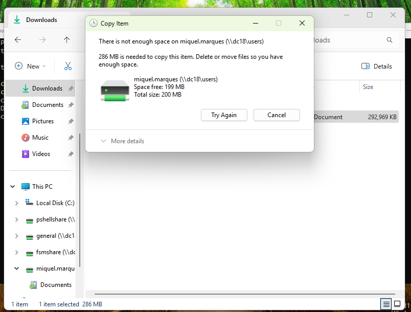

  Si ho provem amb un arxiu que quasi arriba als 200 MB es mostra un avís de què estàs arribant al límit.

  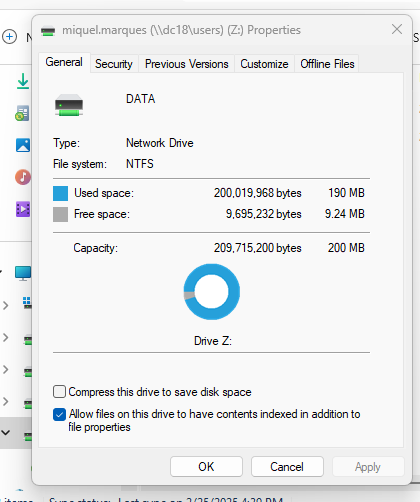
- **Observa a Quota Entries el resultat.**

  El resultat que un arxiu quasi arribi als límit és aquest i si sobrepassa directament no es mostra res perquè no pot ni transferir-se

  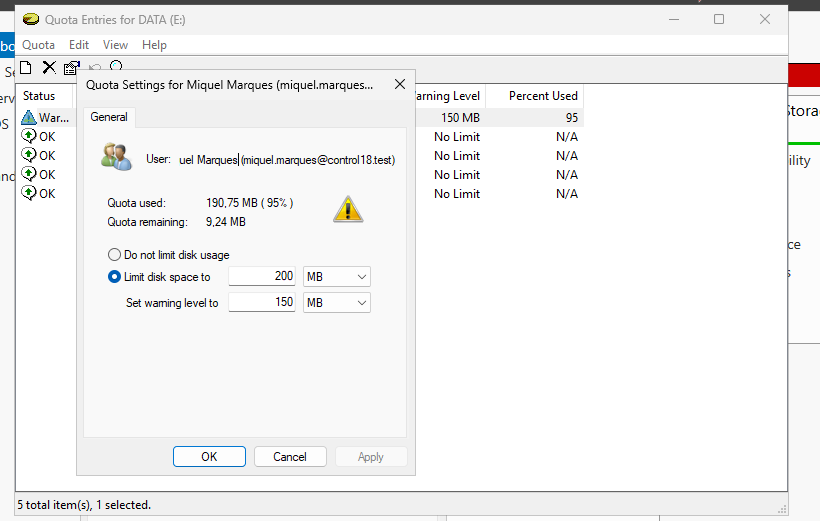
- **Crea una quota el doble per un segon usuari i comprova el funcionament**.

  El primer que faig és anar a la quota entries i posar el segon usuari del domini que tingui

  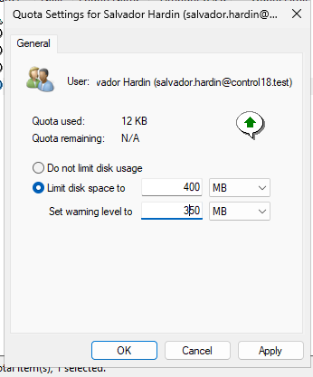

  Un cop aplicat anem al client i tornem a executar la comanda de fsutil per crear un arxiu que ocupi 400 MB en base 10 i després copiem l'arxiu per porvar d’arribar al límit.

    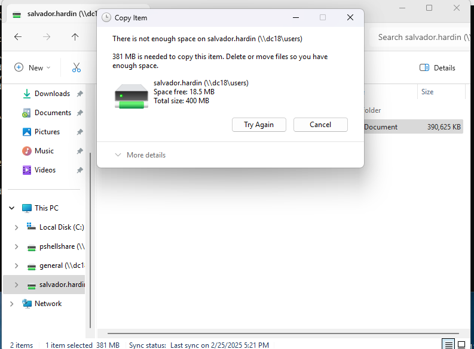 

## Exercici 2
- **Crea una quota d'ús pels usuaris del domini que no permeti l'ús de més de 50 MB sobre la carpeta shared, que ens avisi quan se superi el 90% enviant un correu a l'administrador i a l'usuari que digui "T'has passat".** 

  El primer que fem és crear una quota en el File Server Resource Manager i anem a quotes i allà creem una quota directament on triem on s’aplica la quota.

  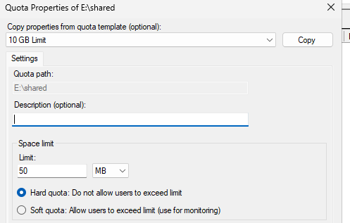

  Seguidament, posem l’espai màxim en la carpeta i si volem que sigui hard o soft que hard es per limitar i soft és per monotonitzar

  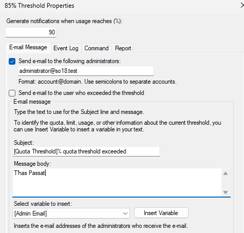
- **Verifica des del client que això passa, creant primer un arxiu de mida 10 MB, posteriorment crea un arxiu de 36 MB i finalment, intenta crear un tercer arxiu de 10 MB.**

  En el final quan passem l'últim arxiu diu que no troba prou espai en el sistema de fitxers i que necessita  9,53 MB en aquest cas i que només té d'espai lliure 6,12 MB

  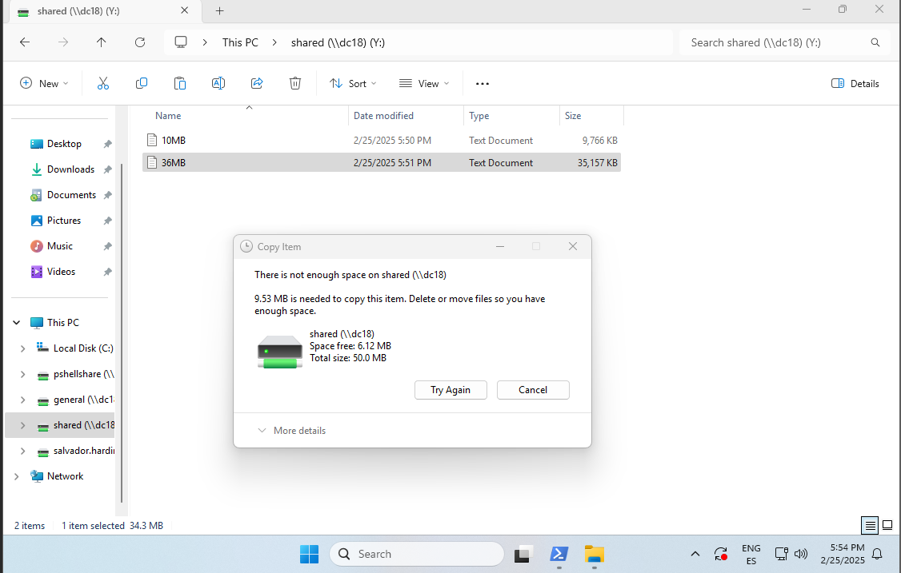

## Exercici 3
- **Crear una plantilla que no permeti gravar arxius executables al segon directori compartit del server.**

  En aquest punt creem la plantilla on posem el nom i quins arxius no volem que  guardin i si és activa, en què prohibeix, o passiva, en què solament monitora, nosaltres òbviament marquem l'Activa.

  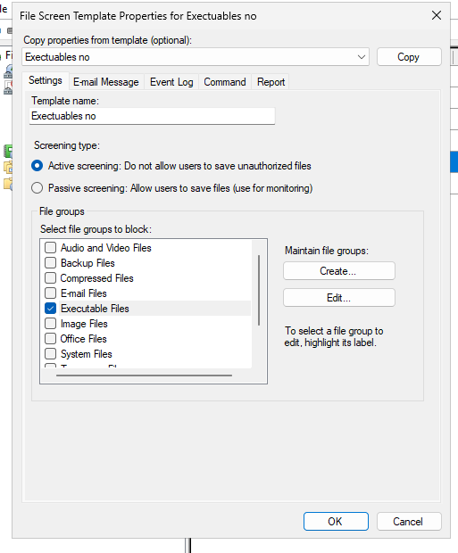

  El següent punt és crear la File Screen on posem la ruta on s’aplica i seguidament marquem si bé d’una plantilla com en aquest cas o si la creem al moment.

  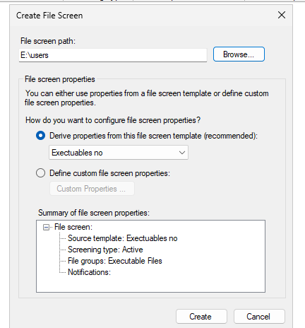

- **Verifica què passa des del client si ho intentes.**

  En aquest cas si creem un arxiu amb el fsutil anomenat ubuntu.exe en que li posem que ocupa 1 byte. 

  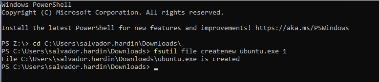

  Després ho intentem copiar en la carpeta d’usuari automàticament diu que necessito permisos per realitzar aquesta acció.

  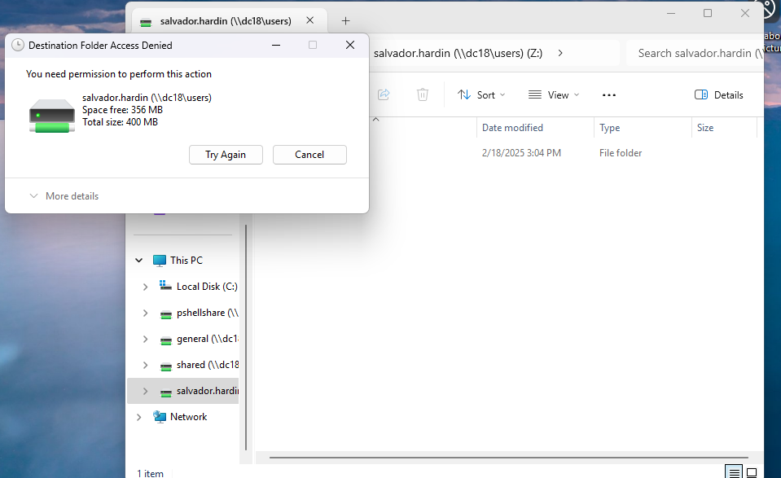

- **Observa què passa si canvies l'extensió a un arxiu .exe abans de copiar-ho al a carpeta.**

En aquest punt modifiquem el nom de l’arxiu 10MB.exe 

  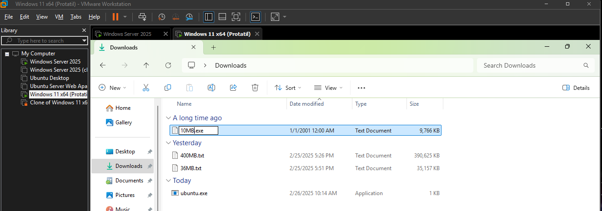

Passa el mateix ens diu que no té permís per poder passar aquest arxiu, ja que aquest mètode del tipus d’arxiu solament agafa com acaba l'arxiu és a dir la comprovació de si es un executable solament es fa si el seu nom acaba en .exe

  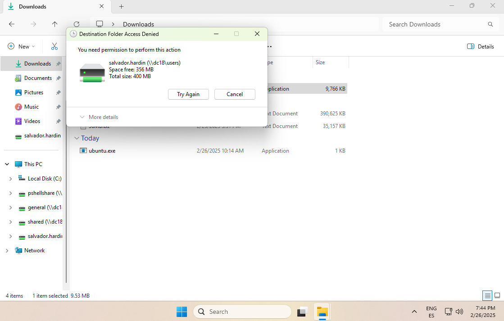

## Exercici 4
- **Crea una planificació de gestió d'arxius obsolets més antics de 30 dies i que els enviï a un directori de backup. Verifica que això passa.**

  El primer que fem és posar el nom de la planificació i l'habilitem.

  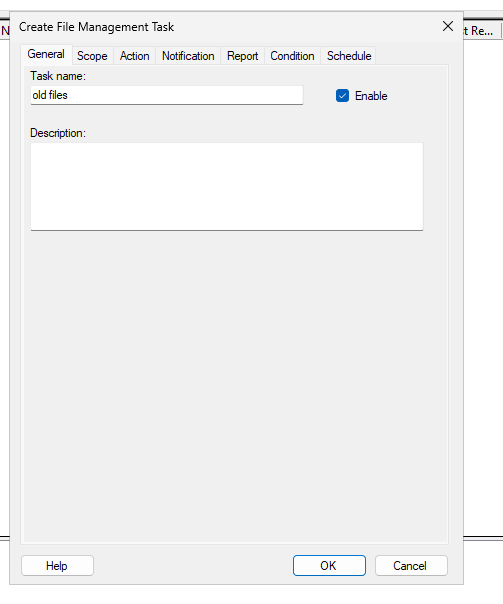

  Seguidament, posem que volem que es mogui quins arxius i quina carpeta és la que serà afectada. En aquest cas marquem arxius d'usuari i de grups i la carpeta és la de user.

  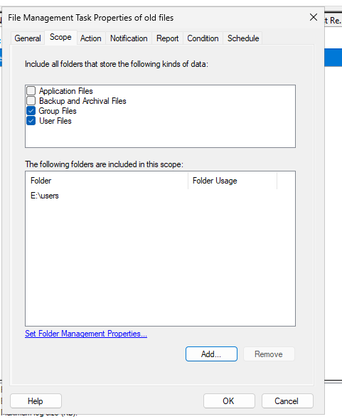

  En aquest punt posem en quina carpeta aniran els arxius que la norma digui, que ja marquem que és tipus ***file expiration*** que significa que si passa també un X temps s’esborri.

  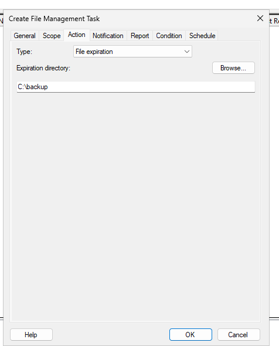

  Tot seguit, posem quina norma apliquem i quant de temps és el que fa que s’esborri i que és mitjançant l'última vegada accedit.

  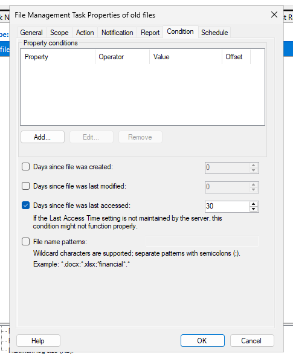

  I en aquest punt posem quan es realitza aquesta revisió.

  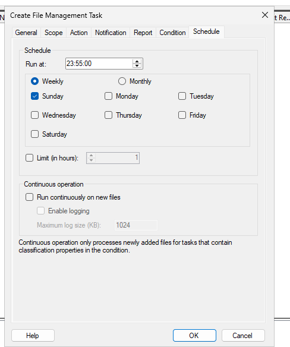
- **Per comprovar l'efecte, caldrà que modifiquis la data d'alguns arxius per tal que sembli que porten més de 30 dies sense ser oberts.**

  En aquest punt si agafem un arxiu que hem creat amb el fsutil i executem les següents 3 comandes que permeten:

- La primera Permet canviar l’hora de la creació
- La segona permet canviar l’hora de l'últim accés 
- La tercera permet canviar l’hora de l'última escriptura 

  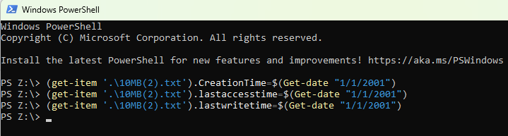

  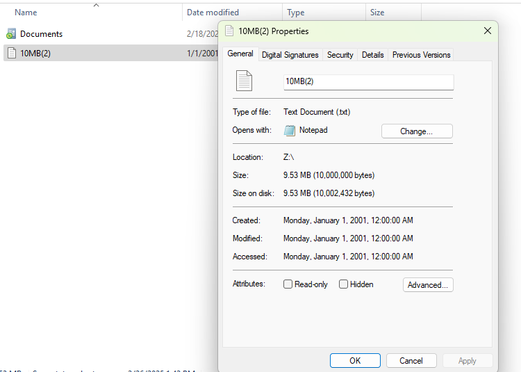

Un cop ho tenim fet anem al servidor i li donem a l’opció d'executar ara el File management Task Now automàticament aquest fitxer desapareixerà i anirà a la carpeta /backup.

  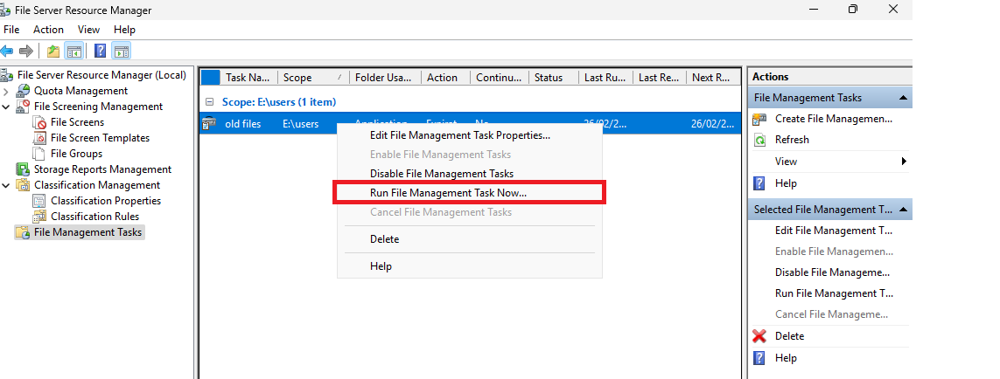
Resultat és el següent per part de l’usuari

  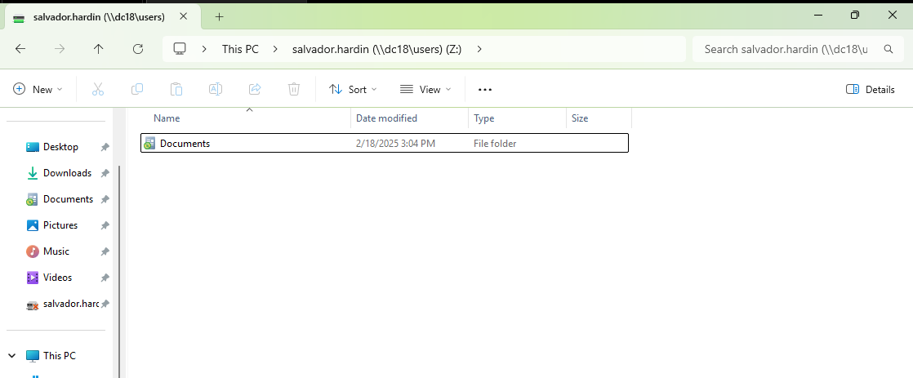
Resultat en el servidor

  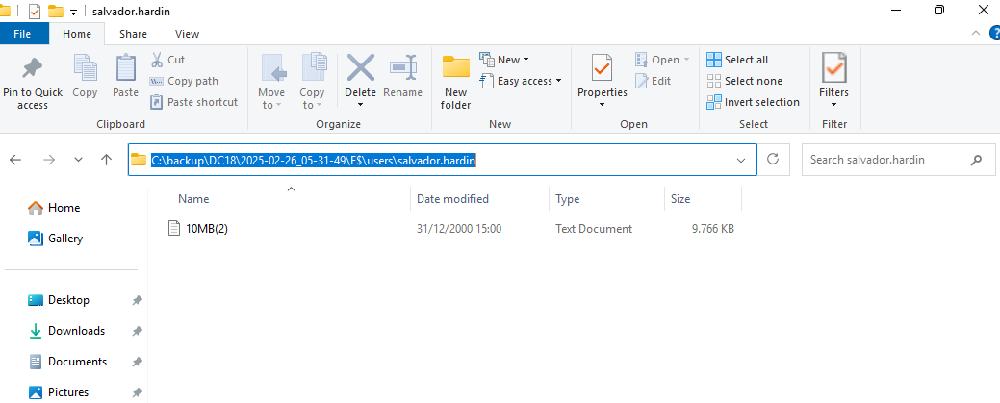
