Miquel Marquès Bravo

**AA3 Servidor d’Impressions Win Server**
##  Printer Pooling
- **Configurar el servidor d'impressió al controlador de domini.**

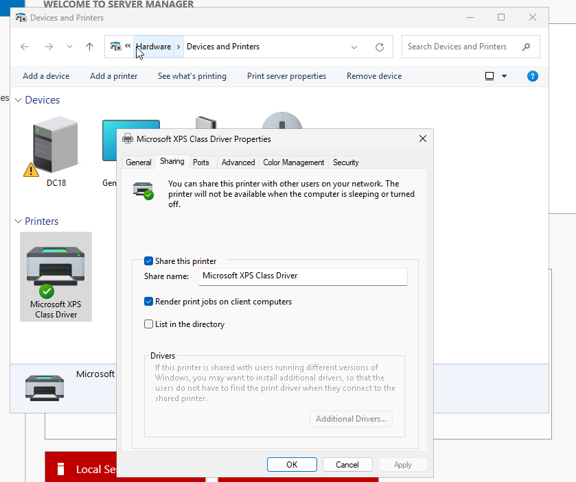

  El primer que fem és compartir la impressora principal per poder compartir-la via xarxa.

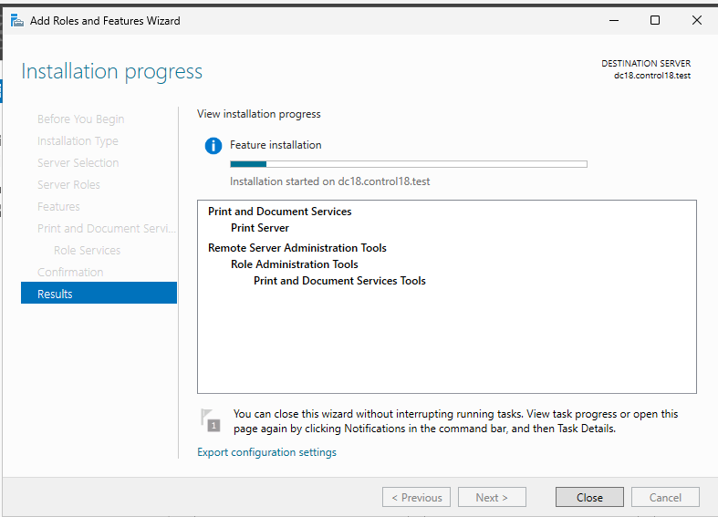

  I després instal·lo el rol de Print and Documents Services.

  Un cop instal·lat creem/instal·lem una nova impressora i a més li marquem que estigui en el segon port.

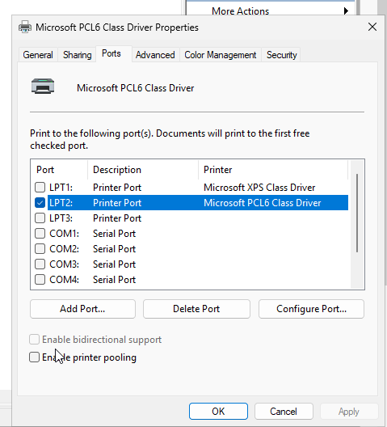

- **Instal·lar una impressora amb cua (dues impressores). Desplegar als clients via GPO**.

  El primer que faig és anar a les propietats de la segona impressora i anar a l’apartat de xarxa i deshabilitar l’opció de xarxa.

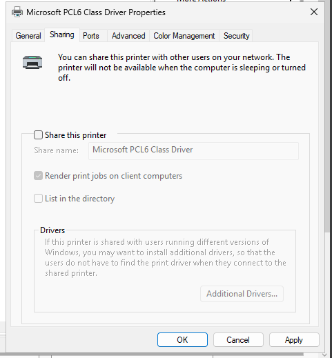

  I seguidament en l’altra impressora habilitem el printer pooling i marquem el segon port per tenir la segona impressora.

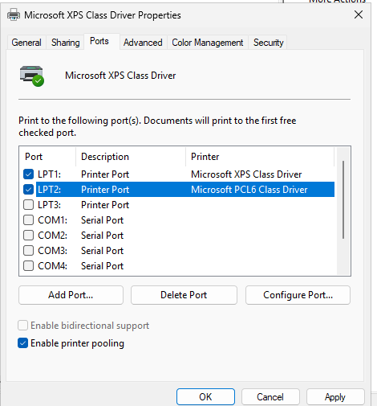

  Després creem la GPO i anem a Computer Configuration i Windows settings i en l'apartat de Deploy Printers afegim la nova impressora amb la seva ruta de xarxa. 

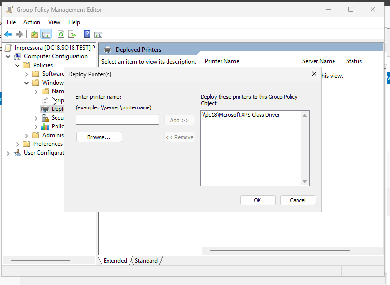

- **Comprovar el funcionament de la cua d'impressió i com diverses impressions es balancegen entre les dues impressores.**

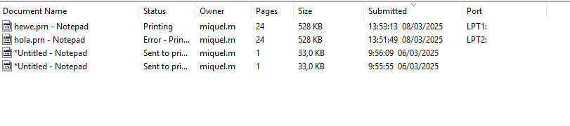
  En aquest punt veiem com les impressions s'imprimeixen entre els dos ports en què el dos pertany a la segona impressora

##  Permisos Impressores
- **Instal·lar una nova impressora i restringir la impressió a un grup del domini. Provar d'imprimir des d'un altre grup.**

  El primer que fem és crear una nova impressora on instal·lem el driver i ho publiquem en el port que queda lliure el port LPT3 

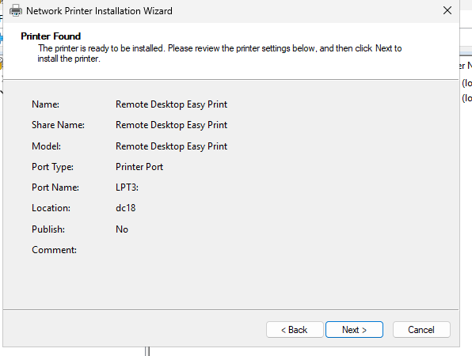

  Un cop realitzat anem a l’apartat de security de propietats de la nova impressora i allà li donem ha advanced, llavors allà seleccionarem everyone i eliminarem el permís i seguidament triarem quin grup volem que pugui imprimir. En aquest cas he posat el grup d’IT perquè pugui imprimir

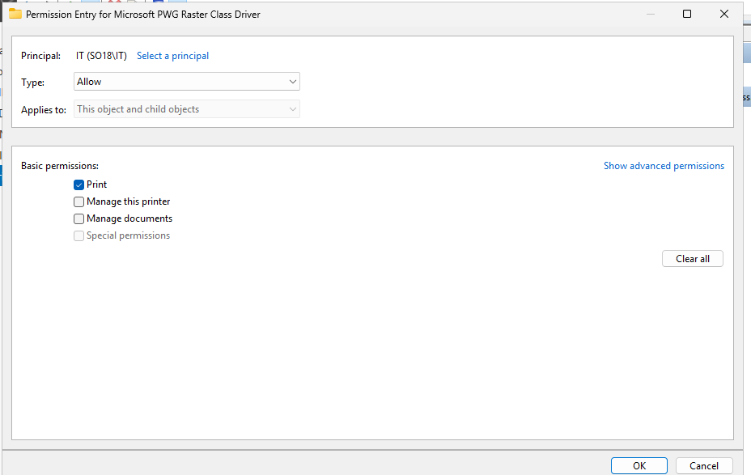

  Resum permisos:

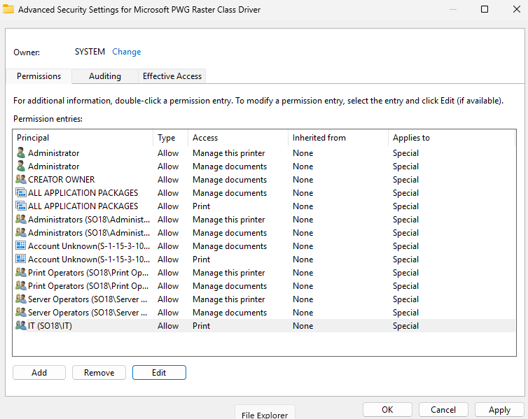

  La comprovació és la següent amb un usuari que no és del grup IT i a través d’intentar accedir no m’ho permet perquè no soc del grup corresponent.

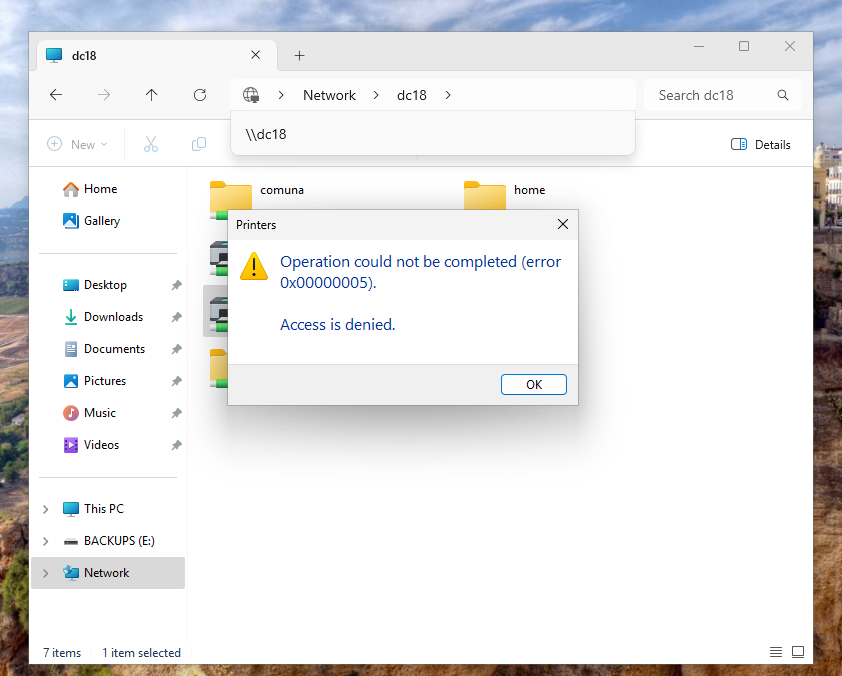

