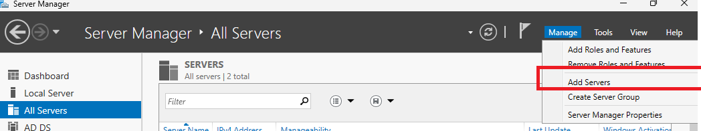
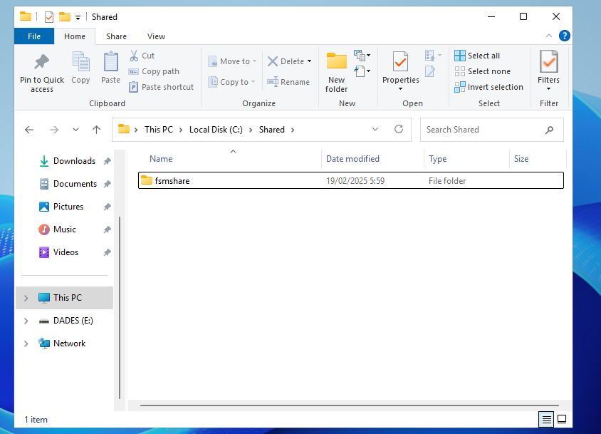

# **ACTIVITAT 1**

1. **Crear un espai de noms que s'anomeni soXX on XX sigui el vostre número de llista.**

  El primer que fem és instal·lar el DFS replication i el DFS namespaces

  

   Després el que fem és accedir en el DFS Management on allà li donarem a l’opció de crear un nou espai de noms 

  

  I seguit ens demanara que posem el nom del servidor en que s’allotjara.

  

  Seguidament, ens demana posa el nom de l'espai i si volem modificar alguna configuració

  

  On si pitgem editar la configuració podem modificar la ruta de la carpeta i a la vegada els permisos de SMB.

  

  En acabar ens demanarà quin tipus de compartició volem si més enfocada a un domini o a un server sol. En què seleccionem a la del domini.

  

   Resum del espai de noms

  

  2. **Afegiu una carpeta compartida que estigui al propi servidor a dins l'espai de noms. Comproveu l'accés des del segon servidor.**

   En aquest punt el que fem és anar a l’espai de noms que hem creat anteriorment i llavors en aquell punt li donem clic dret i li donem a afegir una carpeta que ja tinguem compartida i allà li podem posar el nom que tindrà en veure i després podem posar la carpeta que és en realitat.

   

   I el resultat es aquest on tenim la carpeta de xarxa en aquest espai de noms

   

   3. **Crear una carpeta compartida al segon Server (el que està fent de client) i afegiu-la també a l'espai de noms.** 

   El següent que fem és anar al segon servidor i creem una carpeta que anomenare shared.

   

   I ara, la compartim posant que tothom te acces.  

   

   El següent que fem és anar al DFS Manager i afegir aquesta segona carpeta en l'espai de noms.

   En què posem la ruta de xarxa del segon servidor i ho afegim posem i abans podem posar el nom que vulguem.

4. **Comproveu com es pot accedir usant l'espai de noms, sense haver d'indicar el nom del servidor on es troba.**

   La comprovació és la següent en què solament posant el nom del domini podem veure l'espai de noms i en què no ens demana saber de quin servidor prové aquella carpeta.

   

   # **ACTIVITAT 2**
1. **Configurar el servei de DFS replicació en aquest segon servidor.**

   El Primer que fem és posar el DNS apuntant al servidor del controlador de domini i després nom del servidor DFS i a la vegada el subscrivim al domini.

  

   En acabat en el Server Manager del servidor controlador del domini afegeixes aquest servidor en l'apartat de All Servers que es fa des del botó Manage i afegim el servidor buscant-lo en el domini i movent-lo en el seu lloc.

  

   I un cop tenim afegit el segon servidor podem instal·lar el rol des del controlador de domini

   

   I donem a instal·lar DFS replication que es troba dins del FIle and Storage Services

  

  

  

  Ara ja tenim la instal·lació feta

  2. **Crear un grup de replicació anomenat infXXYY on XXYY siguin els números de llista, que permeti replicar les Carpetes creades a la primera part.**

   Per fer la replicació el que fem és anar a l’apartat del dfs management que posa Replication i allà en el menú d’opcions triem el que volem fer, que en aquest cas és un Replication Group. Allà se'ns obrirà una pestanya per fer el Replication Group. 
   

   En el moment que s’obre la nova pestanya podem triar si solament volem un DFS que tingui les dades o un que mantingui també la compartició. En el nostre cas marquem l'opció que mantingui la compartició.
   

   
   

   En el següent punt ens demana el nom fe la replica i si volem posar una descripció que és opcional, malgrat ser important per poder tenir documentat tot el que has fet

   

   Un cop fet afegim el servidor que volem que es dupliqui i el servidor que volem que sigui duplicat (Aquesta acció pot durar una estona per part de l'altre servidor).

  

   Tot seguit, ens demana quin tipus de replicació volem triarem la ***Full mesh*** que consisteix en una tipologia de malla que serveix tots per tots.

   

   

   Posem quina carpeta volem duplicar

   

   Aqui posem on es vol guardar la duplicacio/replica

   

   Aqui veiem el resum del que hem configurat.

   

   1. **Comprovar el correcte funcionament de la replicació.**

   Per comprovar-ho el que fem és anar a l'explorador d’arxius de l'altre servidor i comprovar que la ruta que havíem posat està la carpeta compartida que volíem replicar. En el meu cas era una carpeta anomenada fsmshare que havia estat feta mitjançant File and Storage Manager.

   

  #
  
  # AAExtra DFS Manager © 2025 by Miquel Marquès Bravo is licensed under [CC BY-NC 4.0 ](https://creativecommons.org/licenses/by-nc/4.0/?ref=chooser-v1)
   
