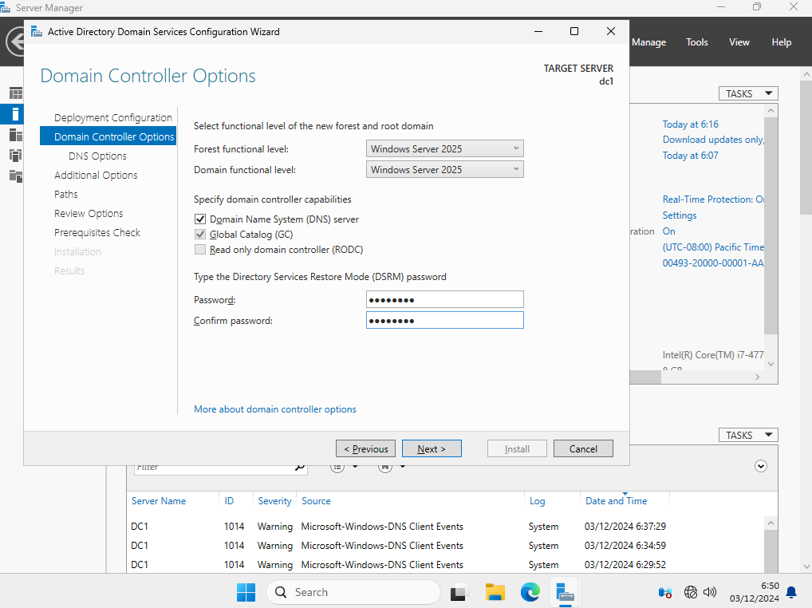
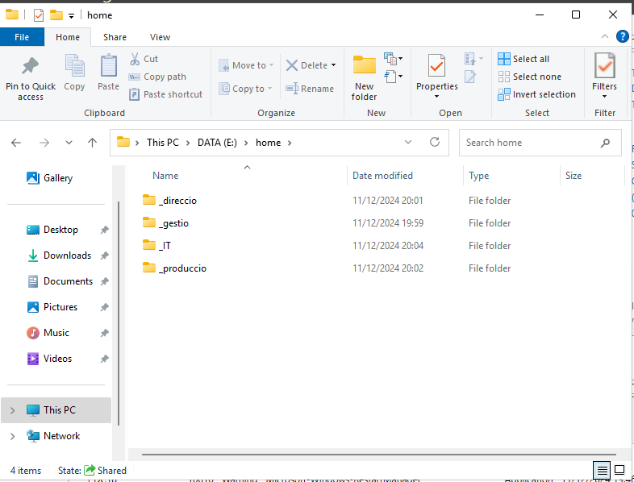
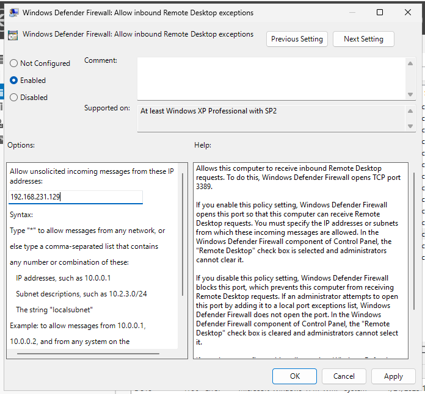
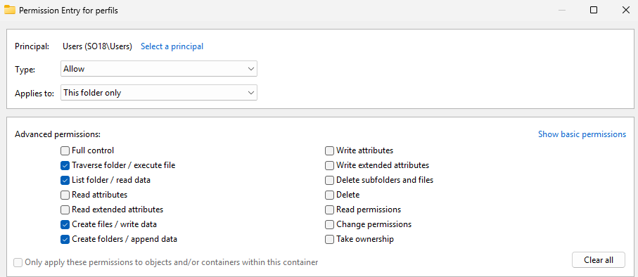
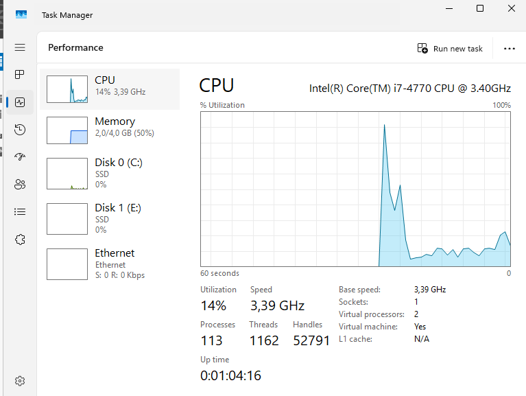

# 1.  <a name="A1"></a> **Recordatoris**

0\.1. Nom d’usuari local i contrasenya **PC01\[nom usuari]**

0\.2. Tenir Configurat el DNS apuntant a ell mateix **127.0.0.1**

0\.3. Nom de la màquina fàcil d’utilitzar

0\.4. Rools and features instal·lar **Active Directory Domain Services** i **promote the server**

0\.5. Vigilar no posar OUs d’usuari dins d’equip i viceversa

0\.6. Usuaris i equips dins d’OUS

0\.7. Sharing >>> Advanced Sharing >>> I Posar **domain users** i **full control**

0\.8. Fer captura de resum permisos NFTS

0\.9. Grups globals i security

0\.10. Plantilles tot configurat però deshabilitats i sense contrasenya

0\.11. Per desplegar software ruta de xarxa i solament permisos d’escriptura

0\.12. Desplegar GPOs en OUs o dominis que toquen i grups.

# 2.  <a name="A2"></a>**Configuració VM**


# 3.  <a name="A3"></a><a name="3"></a>**Instal·lacio VM**


# 4.  <a name="A4"></a>**Configuracio nom i DNS** 
   Server Manager>>> Local Server >>> Computer name>>> Change >>> Computer name: [Afegir nom]
   
   (assegurar que el domini i el nom no son el mateix)


# 5.  <a name="A5"></a>**Configuració del servidor de noms**
   Server Manager>>> Clic en el nom d'Ethernet: [nom adaptador]>>> clic esquerra en l'adaptador >>>Propietats>>>Internet Protocol Version 4>>> propietats>>> Posar DNS 127.0.0.1

   

   (Si no ens apuntem a nosaltres el controlador no ens veu. No funciona res)


# 6. <a name="A6"></a>**Domini en nou bosc amb nom soXX.test i nivell funcional 2025**
   Server Manager >>> Manage >>> Add roles and features >>> Next >>> Role-based or feature based installation >>> Instal·lar en el servidor (Next)>>> Active Directory Domain Services >>>Acceptar instal·lar les dependències (Add Features)>>>Next en Features>>> Next en AD DS>>> Confirmation install 

   

   Un cop instal·lat ens apareix una dependencia que hem de pitjar el botó “promote this server to domain controller”>>>Posar Add a new forest>>> root domain name: [nom]

   

   Next>>>Posar Windows server 2025 i Posar contrasenya

   

   Next (perquè ens diu que no detecta ninguna màquina amb aquell nom)>>>Next >>> I esperar que et doni el nom de NetBios
   

   Next

   

   Li dones a next i comprovarà si la instal·lació és correcta

   

   Li dones a instal·lar on automàticament es reiniciarà amb tot fet

   

# 7. <a name="A7"></a>**Resum procés promoció domini i comandes PowerShell**

   

**Scrypt**

   

# 8. <a name="A8"></a>**Creació de reenviador condicional**

Server Manager >>> DNS >>>Clic esquerre en el Server>>>DNS Manager

   

 DNS Manager>>> doble clic Server>>>Forwarders

   

 Propietats Forwarders>>>Edit>>>Afegir IP del reenviador

   


# 9. <a name="A9"></a>**Canvi horari**
   Time zone: [horari]>>> Change time zone >>> Seleccionar la corresponent i comprovar hora

   

   I per canviar l’hora manualment en el botó de change date and time
# 10. <a name="A10"></a>**Creacio de l’estructura OUs** 
   Active directory Administrative Center>>>Click esquerra >>> New >>> OrganitzationalUnit

   

   


# 11. <a name="A11"></a>**Crear disc compartit**
   **Crear disc a traves de VMbox**

   

 ## <a name="A11.1"></a>**11.1. Formatar disc**

   

   

## <a name="A11.2"></a>**11.2. Crear carpeta i configurar permisos**

   

 ### <a name="A11.2.1"></a>**11.2.1 Permisos de xarxa**
   properties>>>Sharing>>>Advanced Sharing>>>Share this folder>>>Posar un límit d'usuaris a la vegada>>> Permisions>>> afegir “domain users” i posar full control.>>> apply

   

##### <a name="A11.2.2"></a>**11.2.2 Permisos NTFS**
   Properties>>> Security>>>Advanced>>> Disable inheritance>>>pulsa en  **“Convert Inherited permisions into explicit permisions on this object”**
   


   Click en el grup >>> Edit>>>Show advanced permisions>>> posar permisos >>> OK>>>apply

   Resultat:

   

   

   


Aquest resultat pot variar, ja que pot ser que els administradors no puguin tenir el control això depèn de l’empresa.
# 12. <a name="A12"></a>**Creació de grups**
   Active Directori Users and Computers>>> Sobre carpeta Users>>>Clic dret>>> new>>> group>>> grup
   
   

   


# 13. <a name="A13"></a>**Creació de plantilles d’usuari**
   Active directory Users and Computers >>> clic esquerra sobre mataro/usuaris >>> clic dret >>> new >>> user

   

   

   Sobre usuari>>> propieties >>> Profile >>>> connect >>> **[nomequip]\\home\%username%**

   

   Propierties >>> Member of >>> add >>> [grup]

  
   Per comprovar mira la carpeta home
   
   

 Copy user>>> Posar nom  i posar contrassenya i habilitar usuari i posar que canvi la contrassenya

 


# 14. <a name="A14"></a>**Creació d’un ordinador**

   Active directory Users and Computers >>> clic esquerra sobre mataro/computers>>> clic dret >>> new >>> Computer

   

   ## <a name="A14.1"></a><a name="_iv7acn4ztc"></a>**14.1. Configurar la máquina Windows 11**
   Settings >>> About>>>> Domain or workgroup >>> Change>>>Posar el nom i el domini>>> I posar contrasenya administrador

   

   

   I toca canviar la IP del DNS 


# <a name="P1"></a>**P1 GPO**
   **RECORDA:** Nom d’usuari local i contrasenya

   ```PC01\[nom usuari]```

   1. **Configurar la Default Policies perquè els usuaris del domini facin servir una contrasenya de 8 caràcters.**

   Group Policy Management>>> Default Domain Controller>>> Clic dret: Edit..>>> Computer Configuration>>> Policies>>>Windows Settings>>> Security Settings>>>Account Policies >>> Password Policies>>>Minimum Password Lenght >>> Posar 8 caracters

   


1. ` `**Crear GPO en l'OU de Mataró que afecti els usuaris del grup Dirrecio que tingui 18 caracters i 28 dies de duracio sense complexitat.**

   Group Policy Management>>>mataro>>> Clic dret: New GPO i edit.>>> Computer Configuration>>> Policies>>>Windows Settings>>> Security Settings>>>Account Policies >>> Password Policies>>>Minimum Password Lenght >>> Posar 18 caracters >>> Maximum password age>>> 28 dies

   

   Group Policy Management>>>mataro>>> Click>>> Delegation>>> Advanced >>> Treure: Apply this policy als authenticated users >>>Security filtering >>>add:Grup

   

   2. **Mapejat de xarxa**

   Group Policy Management>>>dc.so18.test>>> Clic dret: New GPO i edit.>>> User Configuration>>>Preferences>>>Windows settings>>>Drive Maps >>> clic dret: New

   

**3.1. Altres opcions**

Crear un grup d’usuaris que siguin administradors locals de la màquina Windows.

Crear GPO en mataro>>>edit>>>Computer Configuration>>> Prefences>>> Control panel Settings >>>Local Users and Groups>>>Clic dret: All task>add

   

I el filtratge es queda per tots els usuaris, ja que solament aplicarà en aquell grup d’IT, pel fet que diu que afegeixi el Grup d’IT per

1. **Fer un GPUpdate mitjançant el server**

   Per fer això primer hem d’establir a Domain Controlers la norma que pugui rebre han de tenir l’excepció de rebre remotament dels tallafocs per poder-se fer.

   Group policy Management>>> Domain Controller>>> Edit >>>Computer Configuration>>>Policies>>>Administrative Templates>>> Network>>>Network connections>>>Domain profile
   
   

   Pitges editar la norma i poses en habilitat i la IP del Servidor

   

   Un cop fet ja pots fer remotament una GPUpdate remotament que simplement fent clic dret en una OU apareix l’opció de fer un Gpupdate.

   

   En què li dones i automàticament es fa una actualització de GPO i et mostra el resultat.

# <a name="P2"></a>**P2 Desplegament d’aplicacions**
1. **Crear un GPO per desplegar el 7zip de forma assignada als usuaris de gestió.**

   Group Policy Management>>>Mataró>>> Clic dret: New GPO i edit.>>> User configuration>>> Software Settings >>> add.>>> Poses el paquet msi i tria l’opció advanced

   

   Group Policy Management>>>Mataró>>> GPO >>>User Configuration>>> Security filtering >>add >> Grup>>> eliminar antic grup

   

1. **Crear una GPO per desplegar el Firefox de forma publicada als usuaris de direcció.**

   **S’ha de fer mitjançant una carpeta de xarxa**

   Group Policy Management>>>Mataró>>> Clic dret: New GPO i edit.>>> User configuration>>> Software Settings >>> add i poses la ruta de la carpeta de xarxa>>> Poses el paquet msi i tria l’opció advanced

   

   Group Policy Management>>>mataro>>> GPO >>>User Configuration>>> Security filtering >>add >> Grup>>> eliminar antic grup

   

1. **Com podem crear arxius msi per poder desplegar les nostres aplicacions?**

   Hi ha una sèrie d’eines que permeten agafar un arxiu .exe i convertir-lo en arxiu .msi aquestes eines com MSI wrapper permeten fer la conversió a MSI.

1. **Explicació funcionament** 

   Les GPO filtrades per grup no funcionen si elimines el “Authenticated Users”, per filtrar-ho amb el grup anteriorment seleccionat no funciona, però sí que modificaràs la delegació d'equips i poses que els Authenticathed users solament puguin llegir, però no s'aplica la GPO llavors sí que funciona. 
   

    En la imatge hem de posar aquesta configuració en què l'Authenticated users puguin llegir la GPO, però no s’aplica en ell, i llavors en el scope poses el grup que pertoca i automàticament es posa correctament.
   # <a name="P3"></a>**P3 Perfils**
   RECORDA: Mai posar en el perfil mòbil la redirecció!!! 

1. **Crear dins la unitat de dades, una carpeta que s'anomeni perfils (compartiu-la amb els permisos adients).**

   **Permisos de SMB (xarxa)** 

   Crear carpeta>>> Propietats>>>> Sharing>>> Advanced Sharing
   

   **Permisos NTFS**

   

   

   En aquest cas creo els mateixos permisos que la unitat de xarxa d'home.

1. **Configurar la plantilla de gestio perquè tingui un perfil mòbil.**

   Active Directory User and Computers>>>Anar a la plantilla de gestio>>> Clic dret: propietats>>>Profile>>>Profile path>>> posem la ruta amb %username%

   

1. **Crear un nou usuari de gestió i mostrar com es crea el seu perfil dins aquesta carpeta.**

   Active Directory User and Computers>>>Anar a la plantilla de gestio>>> Clic dret: copy

   

   Un cop fet l'usuari anem a la màquina client i provem d’accedir amb el nou compte.

    I comprovem que la màquina s’ha creat.

   

1. **Configurar una GPO que esborra usuaris més antics que X temps**

   GPO>>>Clic dret: edit>>> Computer preferences >>> Administrative Templates >>> System >>> User Profiles >>> Delete user profiles older than…

   

 # <a name="P4"></a>**P4 Redirecció de Carpetes**
1. **Configurar una directiva per tal que els usuaris del grup gestio, encaminin la carpeta Documentos a una carpeta que també anomenarem Documentos, dins la seva carpeta personal en xarxa (compte no la carpeta de perfil).**

   Group Policy Management>>>Situat sobre l'OU de Mataró>>> New GPO>>> Edit>>> User Configuration>>>Windows Settings>>>Folder redirection>>>Documents propierties

   

   I un cop aplicat filtrem la GPO.

   
   

1. **Documenteu el correcte funcionament del procés.**

   Un cop ho tenim tot fet fem un **gpupdate /force** en què ens demanarà tancar sessió i tornar a entrar i un cop fet entrem a la carpeta de documents i provem de crear un arxiu i també podem veure que a la carpeta apareix una icona de sincronització.

   
# <a name="P5"></a>**P5 Monotritzacio**

1. **Fer una captura de l'estat del servidor: consum CPU,RAM ...**

    Taskmgr>>> Performance>>>CPU

   

    Taskmgr>>> Performance>>>RAM

   

1. **Configureu el sistema per auditar els inicis de sessió dels usuaris (tant els bons com els intents fallits)**

   Group Policy Management >>> GPO: Default Domain Policy Control >>> Clic dret: Edit>>>Computer Preferences >>> Windows Settings >>> Security Settings >>> Local Polices >>> Audit Polices 

   

   

1. **Cercar un log relatiu a Security al Event Viewer. Buscar informació addicional a partir del seu ID.**


1. **Proveu a fer accessos incorrectes al domini i documenteu com queden registrats.**

   

    Queden enregistrats com audit failure i que  la categoria prove de Kerberos Authentication Service. També queda registrat amb quin nom d’usuari es volia accedir a la maquina i quina maquina ha estat en la que han volgut accedir aquest( IP)

1. **Com visualitzar events en el BPA results** 

   Server Manager >>> BPA Results

   

1. **Monitor de fiabilitat**

   Panell de control>>>Sistema>>> Seguretat i manteniment>>>visualitza els missatges arxivats

1. **Auditar accés a recursos**

   Group Policy Management >>> GPO: Default Domain Policy Control >>> Clic dret: Edit>>>Computer Preferences >>> Windows Settings >>> Security Settings >>> Local Polices >>> Audit Polices 

   

    I ara pots veure i pots auditar qui pot accedir a uns arxius qui ho elimina o depen 

   Carpeta ha auditar >>> Clic dret: Propierties >>> Security >>> Advanced >>> Auditing 

   

   I seguidament anar a la GPO i configura les propietats avançades de audit.

   Group Policy Management >>> GPO: Default Domain Policy Control >>> Clic dret: Edit>>>Computer Preferences >>> Windows Settings >>> Security Settings >>> Advanced Audit Policy Configuration >>> Audit Policies >>> Object Acces >>> Audit file system i Audit Handle Manipulation

   

   


# <a name="P6"></a>**P6 Adm. Remota i delegació**

1. **Habilitar RSAT**

   Entrar en la màquina client com a administrador per tal de poder instal·lar el RSAT

   Settings>>>System>>>Optional features >>>View features>>> Buscar:RSAT i afegir RSAT Server Manager i  RSAT Active Directori…

   

1. **Afegir servidor**

   Server Manager>>>Add other servers to manage>>>Buscar el servidor

   

1. **Afegir un grup/usuari en què pugui delegar el servidor**

   Servidor>>>Active Directory Users and Computers>>>Clic dret (Sobre la OU): Delegate Control

   

   

 ## <a name="AA6"></a>**Activitat: AA6 Delegació**

1. **Crea un usuari dins la OU usuaris anomenat adminOU.** 

   Active Directory User and Computers>>> Clic dret(sobre l’OU)New >>> User

   

   


1. **Delega el control de l'OU Mataró per aquest usuari amb les següents regles:**
- **Pot reiniciar els passwords dels usuaris de l'OU.**
- **Pot modificar la pertinença a grups.**

Active Directory Users and Computers>>>Clic dret (Sobre la OU): Delegate Control>>> Usuari>>> I posar els seguents punts


1. **Documenta com aquest usuari no pot crear un usuari nou, però sí que pot fer les accions esmentades sobre un usuari existent.**

   Per comprovar-ho anem a la màquina client i entrem amb l'usuari i contrasenya del adminOU.

   **Comprovar crear usuari**

    Server Manager>>>Active Directory Users and Computers >>> OU de mataró

      

    En aquests de voler crear un usuari ho tenim deshabilitat, per tant, no surt ni l’opció de crear-ho i tampoc surt l’opció de crear un grup o una OU.

    **Canviar contrasenya i canviar pertinença de grup**

   

   

    En aquest cas sí que ho podem realitzar correctament ja que tenim prou delegació per fer-ho. I passa el mateix amb la pertinenca a un grup


##

# Guia Windows Server 2025 © 2025 by Miquel Marquès Bravo is licensed under [CC BY-NC-ND 4.0 ](https://creativecommons.org/licenses/by-nc-nd/4.0/?ref=chooser-v1)


